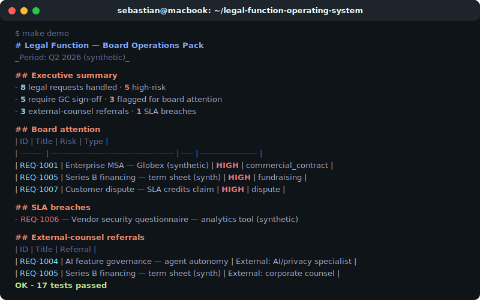

# legal-function-operating-system

See [CASE_STUDY.md](CASE_STUDY.md) for the problem, controls, and limitations.



A deterministic **legal function operating system**: it takes incoming legal requests and runs each through **intake → risk → priority → routing → SLA → approval matrix → external-counsel decision tree → escalation**, then rolls them up into a **board-ready operations pack**.

It answers the question a first legal hire or GC actually faces: *how do I run a legal function at scale — consistently, with the right things escalated, and a clear view for the board?*

This is a management and triage artifact, **not legal advice**. All bundled data is **synthetic**.

> **If you don't code:** scroll to [What the demo produces](#what-the-demo-produces). The repo ships a board pack you can read in the browser. The point isn't the code; it's whether the legal function is structured, prioritised, and governed — not run from an inbox.

## Why this exists

Most "legal AI" shows a model drafting text. The harder, more valuable problem in a scaling software business is **operations**: every request triaged the same way, the right approvals enforced, external counsel used deliberately, SLAs tracked, and the board given a true picture. This encodes that operating layer as deterministic rules a lawyer can read and challenge.

It is the companion to the rest of this portfolio: evaluation (`contract-review-eval-harness`), supervised workflow (`legal-ops-agent`), and source-grounded regulatory checks (`dpa-and-data-transfer-review`). This repo is the layer that **runs the function**.

## Run it

```bash
git clone https://github.com/sebastianfoerste/legal-function-operating-system
cd legal-function-operating-system
make install   # no third-party dependencies — standard library only
make test      # deterministic unit tests
make demo      # writes examples/board-pack.md and .json, prints the pack
```

Runs end to end, offline and deterministically, against the synthetic request set in `data/sample_requests.json`.

## What the demo produces

From eight synthetic requests, the operating system produces a board pack that **surfaces the three items a board should see, the SLA breach, and the external-counsel referrals** — automatically:

```
# Legal Function — Board Operations Pack

## Executive summary

- 8 legal requests handled · 5 high-risk
- 5 require GC sign-off · 3 flagged for board attention
- 3 external-counsel referrals · 1 SLA breaches

## Board attention
| ID | Title | Risk | Type |
| --- | --- | --- | --- |
| REQ-1001 | Enterprise MSA — Globex (synthetic) | HIGH | commercial_contract |
| REQ-1005 | Series B financing — term sheet (synthetic) | HIGH | fundraising |
| REQ-1007 | Customer dispute — SLA credits claim (synthetic) | HIGH | dispute |
```

The full pack (risk/priority/queue breakdowns, pending approvals, the request register) is committed at [`examples/board-pack.md`](examples/board-pack.md) and [`examples/board-pack.json`](examples/board-pack.json).

## The operating layer

| Capability | What the rules do | Where |
| --- | --- | --- |
| **Risk assessment** | HIGH/MEDIUM/LOW from value, personal data, non-EEA transfer, uncapped liability, dispute size | `rules.assess_risk` |
| **Priority** | P1–P4 from urgency + risk | `rules.assess_priority` |
| **Routing** | Request type → owning queue (Commercial, Privacy, Corporate/GC, Litigation, Employment, Legal Ops (AI)) | `rules.route` |
| **SLA model** | Response + resolution targets per priority | `rules.SLA` |
| **Approval matrix** | Binding sign-off tier by value/risk; always ends with a human | `rules.approval_chain` |
| **External-counsel decision tree** | In-house vs litigation/corporate/specialist referral | `rules.external_counsel` |
| **Escalation rules** | SLA breach, high-risk blocker, >€1m, disputes | `rules.escalations` |
| **Board pack** | Aggregates everything into an executive view | `board_pack.py` |

## How it is built

- **Deterministic.** Same requests, same pack — there is a test for it. No model calls, no network.
- **Legible.** Every rule is a short, readable function a lawyer can agree or disagree with.
- **Governed.** Every request ends with a human approval tier; nothing self-approves.
- **Composable.** Drop this in alongside `ai-saas-legal-ops-starter-kit` as its operating core, or run it standalone.

```
src/legal_function_os/
  rules.py        # routing, risk, priority, SLA, approval matrix, escalation, external counsel
  board_pack.py   # aggregate decisions into a board-ready pack
  cli.py          # python -m legal_function_os.cli --input data/sample_requests.json --out examples
data/sample_requests.json   # synthetic request set (incl. a planted SLA breach and board items)
examples/                   # committed sample board pack (md + json)
tests/test_rules.py         # deterministic tests, standard-library unittest
```

Pipeline gating: `--fail-on-breach` makes the CLI exit non-zero when an SLA has been missed, so it can sit in a weekly reporting job.

## Scope and disclaimers

This models the **operations** of a legal function over a structured representation of requests. It does not give legal advice, does not draft documents, and does not establish a lawyer-client relationship. The rules and bands are illustrative defaults, meant to be tuned to a specific business. Every bundled example is synthetic.

## License

MIT. See [`LICENSE`](LICENSE).
