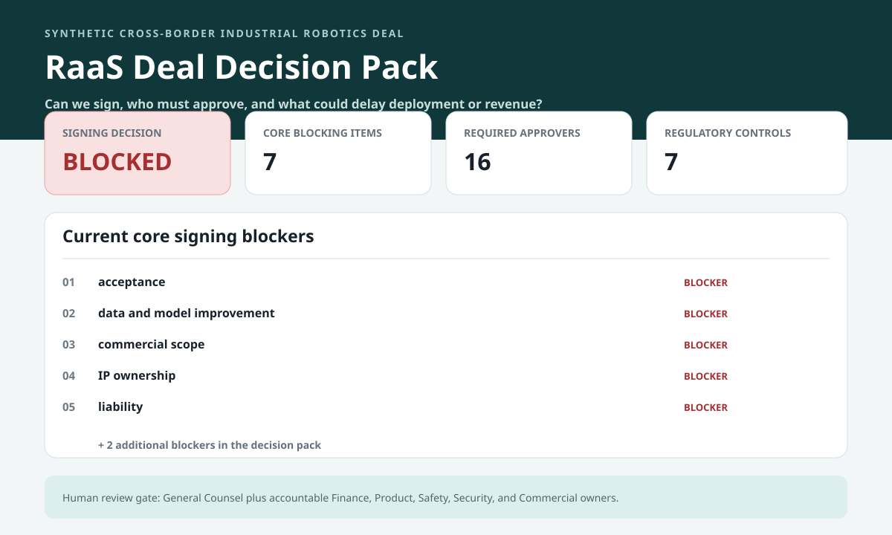

# legal-function-operating-system

A deterministic legal operating layer for a first General Counsel. The flagship
case study is a synthetic cross-border industrial robotics and
Robotics-as-a-Service transaction.



The first screen answers four management questions:

1. Can we sign?
2. Which positions remain open?
3. Who must approve them?
4. What could delay deployment or revenue?

All bundled data is synthetic. Every consequential decision requires human review.
The repository does not provide legal or accounting advice.

## Two-minute reviewer path

1. Open the generated [RaaS deal decision pack](examples/raas-deal-pack.md).
2. Read the [industrial robotics case study](RAAS_CASE_STUDY.md).
3. Check the dated [primary-source manifest](examples/raas-source-manifest.json).
4. Run `make test && make demo && make check`.

The generated [HTML deal room](examples/raas-deal-room.html) is an offline local
artifact. Download or clone the repository before opening it.

For a short recording, use the [90-second reviewer script](docs/RAAS_REVIEWER_SCRIPT.md).
The portfolio proof contract is available at
[`docs/portfolio-proof.json`](docs/portfolio-proof.json).

## What the RaaS demo proves

The synthetic transaction covers a 36-month, multi-site modular robotics framework
for Germany and the United States. It combines:

- robots and retained hardware title;
- site integration and commissioning;
- fleet-management software;
- AI vision and path planning;
- remote monitoring and predictive maintenance;
- support and software updates;
- product telemetry and model improvement; and
- recurring service fees with uptime commitments.

The customer draft contains deliberately difficult positions. The deterministic
review produces:

- 11 clause-level playbook reviews;
- six substantive contract non-starters;
- one linked Finance blocker;
- eight IFRS 15, ASC 606, IFRS 16, and ASC 842 review questions;
- seven regulatory readiness controls;
- four scoped external-counsel instruction packs; and
- a founding General Counsel 100-day plan.

The signing answer is explicit: **do not sign the current synthetic draft**.

## Negotiation guardrails

Each rule records the requested position, standard position, fallback, escalation
trigger, required approvers, commercial rationale, and the precise synthetic input
used as evidence.

The playbook covers:

- liability;
- objective acceptance and commissioning;
- platform, model, and improvement IP;
- product data and model training;
- product and site safety;
- uptime and service credits;
- termination and deployment-cost recovery;
- cybersecurity and remote access;
- exclusivity;
- hardware custody, insurance, and removal; and
- AI safety-component classification.

The stable public facade is
[`src/legal_function_os/raas_deal_desk.py`](src/legal_function_os/raas_deal_desk.py).
Validation, legal sources, decision rules, and renderers are kept in separate modules.
The input is
[`data/raas_deal.json`](data/raas_deal.json).

## Finance handoff

The pack routes accounting questions to Finance and avoids automated conclusions.
It covers:

- performance obligations;
- acceptance and transfer of control;
- variable consideration and service credits;
- enforceable contract term;
- lease assessment;
- options and contract modifications;
- letters of intent and side commitments; and
- the Germany-US contracting and intercompany model.

Finance remains the accountable decision-maker. Legal owns the factual consistency
of the agreement, order form, statement of work, remedies, and side commitments.

## Regulatory readiness

The readiness matrix distinguishes the relevant actor, obligation or classification
question, deal relevance, signing or deployment effect, owner, target date,
required evidence, legal effect, and primary source.

It covers:

- the current EU machinery framework;
- the Machinery Regulation transition;
- the Artificial Intelligence Act;
- the Data Act;
- the Cyber Resilience Act;
- the revised Product Liability Directive; and
- GDPR and international transfers.

The legal-source snapshot is dated `2026-07-16` and protected by a deterministic
SHA-256 digest. The source registry distinguishes directly applicable regulations
from directives that depend on national implementation. Application and
classification depend on verified product facts and the law current at the actual
review date.

## Run it

```bash
git clone https://github.com/sebastianfoerste/legal-function-operating-system
cd legal-function-operating-system
make install
make test
make demo
```

The project uses Python 3.10 or later and the standard library only.

`make demo` regenerates:

- [`examples/board-pack.md`](examples/board-pack.md)
- [`examples/board-pack.json`](examples/board-pack.json)
- [`examples/raas-deal-pack.md`](examples/raas-deal-pack.md)
- [`examples/raas-deal-pack.json`](examples/raas-deal-pack.json)
- [`examples/raas-deal-room.html`](examples/raas-deal-room.html)
- [`examples/raas-deal-desk.svg`](examples/raas-deal-desk.svg)
- [`examples/raas-source-manifest.json`](examples/raas-source-manifest.json)

The RaaS signing gate can also be used in a pipeline:

```bash
PYTHONPATH=src python -m legal_function_os.raas_cli \
  --input data/raas_deal.json \
  --out examples \
  --fail-on-blocker
```

The command exits with status `1` while the signing gate is blocked.
Malformed inputs exit with status `2`. Ordinary artifact generation exits with
status `0`.

## General legal-function operating layer

The repository also runs incoming legal requests through:

`intake -> risk -> priority -> routing -> SLA -> approval matrix -> external-counsel decision -> escalation -> board reporting`

The original synthetic request set produces:

- a risk and priority decision for every matter;
- an owning legal queue;
- a response and resolution SLA;
- a binding human approval tier;
- an external-counsel decision;
- board-attention and SLA escalation flags;
- a request vault and guided workflow set; and
- a board operations pack.

Read the original [general legal-function case study](CASE_STUDY.md) and
[board pack](examples/board-pack.md).

## Repository structure

```text
src/legal_function_os/
  rules.py                 general request routing and approval rules
  board_pack.py            board operations pack
  workspace.py             request vault and GC command center
  collaboration_workspace.py
                           local approved knowledge and supervised workflows
  raas_deal_desk.py        stable public RaaS facade
  raas_models.py           versioned input contract, validation, and output types
  raas_rules.py            playbook, Finance, regulation, counsel, and 100-day plan
  raas_sources.py          dated primary-source registry and legal-effect metadata
  raas_renderers.py        Markdown, HTML, SVG, and JSON proof artifacts
  raas_cli.py              RaaS artifact generation and blocker gate
data/
  sample_requests.json     synthetic general legal requests
  raas_deal.json           synthetic Germany-US robotics deal
examples/                  committed reviewer and machine-readable outputs
tests/                     deterministic standard-library tests
scripts/                   generated-artifact and portfolio-proof checks
```

## Controls

- Synthetic inputs only.
- Deterministic offline execution.
- Human approval for every consequential position.
- Primary-source provenance for regulatory controls.
- No external communication.
- No contract signature or self-approval.
- No client or customer data.
- No automated legal or accounting conclusion.

## Known limitations

1. The thresholds and fallback positions are illustrative internal guardrails.
2. The system operates over structured JSON rather than a live CLM or CRM.
3. Approval roles are modelled and are not connected to an identity provider.
4. US-law issues are routed to qualified US counsel.
5. Product classification requires the actual intended purpose, architecture, risk
   assessment, conformity path, and deployment facts.
6. Regulatory dates and requirements require confirmation when the analysis is used.

## Human-authored judgment

AI tools assisted implementation. The operating model, issue selection, rule
structure, escalation logic, approval design, regulatory framing, and review
boundaries carry the substantive value. The objective is to make legal judgment
structured, testable, and reviewable.

## License

MIT. See [`LICENSE`](LICENSE).
