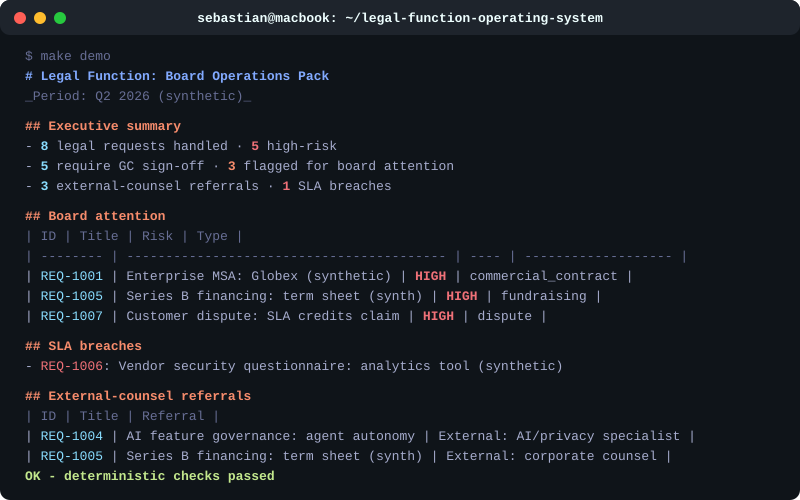

# legal-function-operating-system

A deterministic legal function operating system for consistent intake, risk,
priority, routing, service levels, approvals, external-counsel decisions,
escalation, and board reporting.



The system answers the operating questions a first legal hire or General Counsel
faces as a company scales:

1. Which matters require attention first?
2. Who owns the next step?
3. Which approval tier applies?
4. When should specialist counsel or the board become involved?

All bundled data is synthetic. Every consequential decision requires human review.
The repository does not provide legal or accounting advice.

The supervised legal-operations agent is maintained in `supervised-agent`. Both components retain their own Python runtime and test gate. Their interoperability boundary is `contracts/legal-workflow-controls.v1.schema.json`, which normalizes review state, approval gates, source boundaries and audit events without changing either component's public interfaces. Run `make contract-check` for the shared contract, `make agent-check` for the agent and `make check` for the combined gate.

## Two-minute reviewer path

1. Read the [general legal-function case study](CASE_STUDY.md).
2. Open the generated [board operations pack](examples/board-pack.md).
3. Review the [architecture flow](docs/architecture.svg).
4. Run `make check`.

The machine-readable portfolio proof contract is available at
[`docs/portfolio-proof.json`](docs/portfolio-proof.json).

## Operating model

Each incoming legal request moves through a deterministic pipeline:

`intake -> risk -> priority -> routing -> SLA -> approval matrix -> external-counsel decision -> escalation -> board reporting`

The synthetic request set produces:

- a risk and priority decision for every matter;
- an owning legal queue;
- response and resolution service levels;
- a binding human approval tier;
- an external-counsel decision;
- board-attention and SLA escalation flags;
- a request vault and guided workflow set; and
- a board operations pack.

The generated board pack surfaces three board-attention items, one SLA breach, and
three external-counsel referrals across eight synthetic requests.

## Core capabilities

| Capability | Deterministic output | Implementation |
| --- | --- | --- |
| Risk assessment | HIGH, MEDIUM, or LOW based on structured facts | `rules.assess_risk` |
| Priority | P1 to P4 from urgency and risk | `rules.assess_priority` |
| Routing | Owning legal queue by request type | `rules.route` |
| SLA model | Response and resolution targets | `rules.SLA` |
| Approval matrix | Human sign-off tier by value and risk | `rules.approval_chain` |
| External counsel | In-house or scoped specialist referral | `rules.external_counsel` |
| Escalation | SLA, value, dispute, and blocker flags | `rules.escalations` |
| Board reporting | Executive roll-up and request register | `board_pack.py` |

The workspace outputs add a deterministic request vault, guided workflows, a GC
command center, operational lists, and a local knowledge portal. Portal answers
cite approved local resources or return an insufficient-evidence result.

## Specialist deal-desk case studies

### Industrial robotics and Robotics-as-a-Service

The repository includes a specialist deal-desk workflow for a synthetic 36-month,
multi-site industrial robotics transaction covering Germany and the United States.
It demonstrates how the general operating model can support a complex combination
of hardware, software, AI, deployment services, telemetry, maintenance, and
recurring service fees.

Start with:

1. the [industrial RaaS case study](RAAS_CASE_STUDY.md);
2. the generated [deal decision pack](examples/raas-deal-pack.md);
3. the dated [primary-source manifest](examples/raas-source-manifest.json); and
4. the generated [decision cockpit](examples/raas-deal-desk.svg).

The generated [HTML deal room](examples/raas-deal-room.html) is an offline local
artifact. Download or clone the repository before opening it. A concise walkthrough
is available in the [reviewer script](docs/RAAS_REVIEWER_SCRIPT.md).

The specialist workflow preserves:

- clause-level playbook reviews and negotiation guardrails;
- signing blockers, escalation triggers, and named approvers;
- Finance review questions for IFRS 15, ASC 606, IFRS 16, and ASC 842;
- a regulatory readiness matrix with dated primary-source provenance;
- scoped external-counsel instruction packs; and
- a first 100-day legal-function implementation plan.

The signing answer for the bundled synthetic draft is explicit: **do not sign**.
Finance remains accountable for accounting conclusions, qualified external counsel
owns referred jurisdiction-specific advice, and the business retains every approval.

## Run it

```bash
git clone https://github.com/sebastianfoerste/legal-function-operating-system
cd legal-function-operating-system
make install
make test
make demo
make check
```

The project uses Python 3.10 or later and the standard library only. Execution is
offline and deterministic.

`make demo` regenerates:

- [`examples/board-pack.md`](examples/board-pack.md)
- [`examples/board-pack.json`](examples/board-pack.json)
- [`examples/raas-deal-pack.md`](examples/raas-deal-pack.md)
- [`examples/raas-deal-pack.json`](examples/raas-deal-pack.json)
- [`examples/raas-deal-room.html`](examples/raas-deal-room.html)
- [`examples/raas-deal-desk.svg`](examples/raas-deal-desk.svg)
- [`examples/raas-source-manifest.json`](examples/raas-source-manifest.json)

The specialist signing gate can be used in a pipeline:

```bash
PYTHONPATH=src python -m legal_function_os.raas_cli \
  --input data/raas_deal.json \
  --out examples \
  --fail-on-blocker
```

Ordinary generation exits with status `0`. A blocked signing gate exits with
status `1`. Invalid input exits with status `2`.

## Repository structure

```text
src/legal_function_os/
  rules.py                 general request routing and approval rules
  board_pack.py            board operations pack
  workspace.py             request vault and GC command center
  collaboration_workspace.py
                           approved local knowledge and supervised workflows
  raas_deal_desk.py        stable specialist deal-desk facade
  raas_models.py           versioned input contract and validation
  raas_rules.py            playbook, Finance, regulation, counsel, and plan rules
  raas_sources.py          dated primary-source registry
  raas_renderers.py        Markdown, HTML, SVG, and JSON outputs
  raas_cli.py              artifact generation and blocker gate
data/
  sample_requests.json     synthetic general legal requests
  raas_deal.json           synthetic specialist transaction
examples/                  committed reviewer and machine-readable outputs
tests/                     deterministic standard-library tests
scripts/                   artifact and portfolio-proof verification
```

## Controls

- Synthetic inputs only.
- Deterministic offline execution.
- Human approval for every consequential position.
- Primary-source provenance for regulatory controls.
- Explicit Finance and external-counsel review boundaries.
- No external communication.
- No contract signature or self-approval.
- No client or customer data.
- No automated legal or accounting conclusion.

## Known limitations

1. Thresholds and fallback positions are illustrative internal guardrails.
2. The system operates over structured JSON instead of a live CLM or CRM.
3. Approval roles are modelled and are not connected to an identity provider.
4. US-law issues are routed to qualified US counsel.
5. Product classification requires verified intended-purpose, architecture,
   safety, conformity, and deployment facts.
6. Regulatory dates and requirements require confirmation at the actual review date.

## Human-authored judgment

AI tools assisted implementation. The operating model, issue selection, rule
structure, escalation logic, approval design, regulatory framing, and review
boundaries carry the substantive value. The objective is to make legal judgment
structured, testable, and reviewable.

## License

MIT. See [`LICENSE`](LICENSE).
